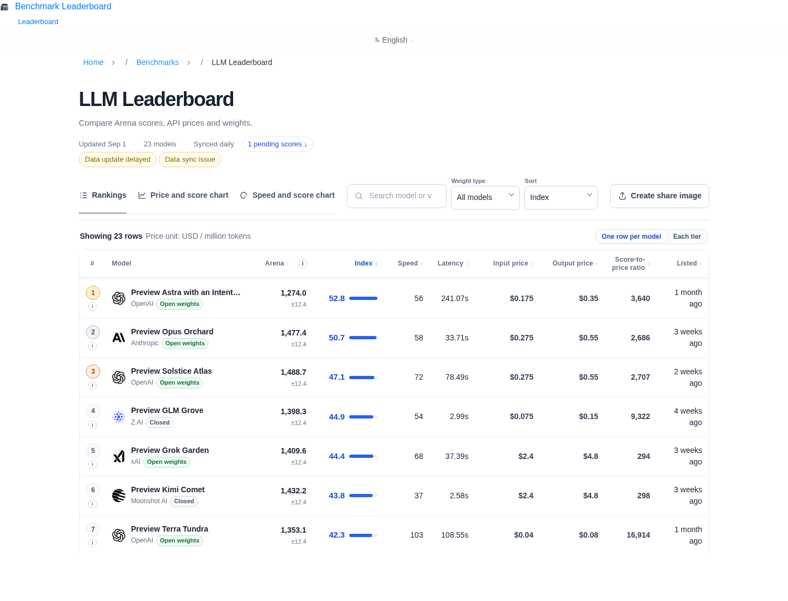
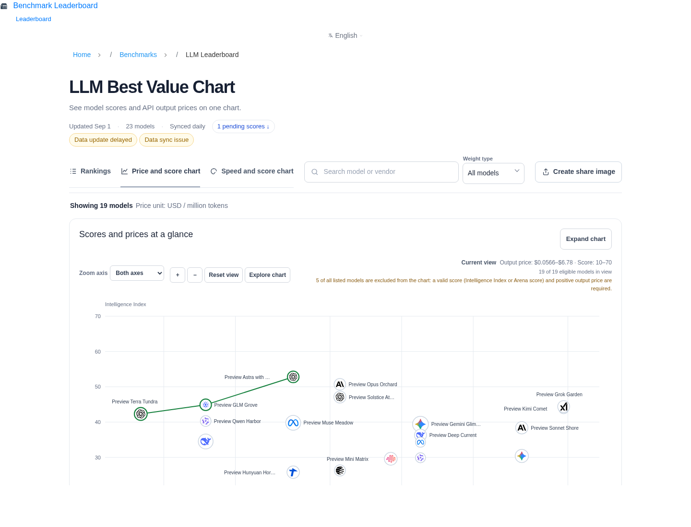
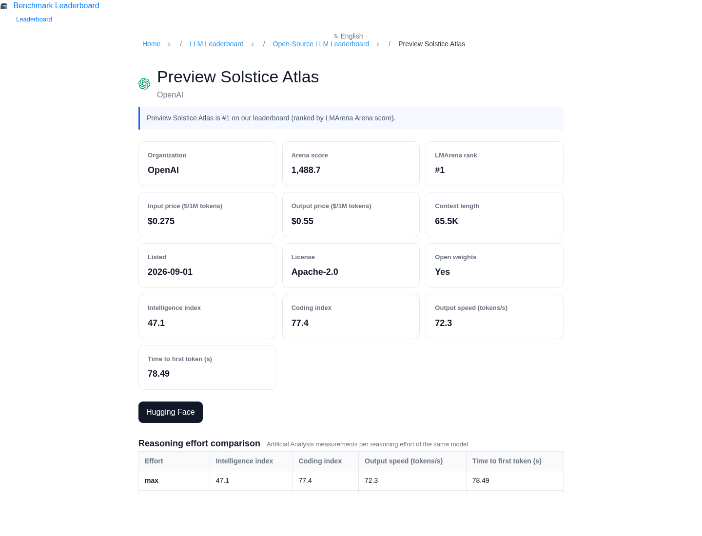

# LLM Benchmark Leaderboard

> 自托管的大模型排行榜 —— PHP 8.1（零框架）+ JSON 快照，**无数据库依赖**，服务端渲染。

[](LICENSE)
[](https://www.php.net/)

从**开源 / 编程 / 性价比 / 最新 / 速度**等多个维度对比主流大模型。

> ⚠️ **本仓库自带的是虚构示例数据**（24 个 Preview* 模型，`data/llm-leaderboard.sample.json`），仅用于演示界面。
> 真实分数需自行运行 `scripts/sync-llm-leaderboard.php` 从上游数据源拉取：Arena 评分来自 LMArena
> （Bradley-Terry 口径，数据需遵守上游条款），价格与上架信息来自 OpenRouter；Artificial Analysis
> 源默认关闭（`show_aa=false`），启用前请先阅读其 Data Platform Terms。

> 由 [17nas.com](https://17nas.com/) 开源 —— 一个 NAS 与网络工具站。

## Screenshots

| 排行榜 | Pareto 性价比图 | 模型详情页 |
|---|---|---|
|  |  |  |
*截图均为虚构示例数据*

---

## Features

- 排行榜 `llm-leaderboard.php`：8 个视图（all / open / code / cheap / new / pareto / speed / intel），SSR + 无 JS 可点的排序/筛选链接
- 按模型或按推理档位（effort tier）两种行口径，同族行色条相连
- Arena 置信区间徽标（±）与「榜级分辨率」提示：相邻名次差落在区间内时直说不必过度解读
- Pareto 前沿图（价格轴 / 速度轴两套口径）与一键分享海报（SVG→PNG，本地生成）
- 模型详情页 `llm-model.php?id=…`：评分/排名/价格/上下文/档位变体对比/同厂商模型
- 多语言 5 语（zh-CN 默认 + zh-TW / en-US / ja-JP / ko-KR），扁平语言文件
- SEO：自指 canonical、hreflang、JSON-LD（ItemList / FAQPage / SoftwareApplication）、非法参数自动 noindex
- 每日同步脚本 + 排名升降箭头（对最近一份历史归档比较）

## Quick start（Docker，一条命令）

```bash
docker compose up -d --build
# 打开 http://localhost:8080
```

镜像内自动：`config/*.example.php` → `config/*.php`，并把 `data/llm-leaderboard.sample.json`（24 个虚构模型）放进 `cache/llm/`。**没有数据库**——榜单读本地 JSON 快照。

## 手动部署

```bash
cp config/site.example.php config/site.php           # 改 site_url / site_name
cp config/analytics.example.php config/analytics.php # 可选，GA4/GSC
cp config/llm_sources.example.php config/llm_sources.php
mkdir -p cache/llm logs
cp data/llm-leaderboard.sample.json cache/llm/llm-leaderboard.json
# Web 根指向仓库根目录，打开 /llm-leaderboard.php
```

## 每日同步（真实数据）

```bash
php scripts/sync-llm-leaderboard.php            # 拉取 + 合并写 cache/llm/llm-leaderboard.json
php scripts/sync-llm-leaderboard.php --dry-run  # 只演练合并（不写文件）
php scripts/sync-llm-leaderboard.php --pull-only
```

- LMArena（HF datasets-server，CC-BY-4.0 数据集）与 OpenRouter 默认启用，缺 key 也能跑（匿名档）
- **Artificial Analysis 默认关闭**（`show_aa=false`）：请先读 [docs/UPSTREAM-TOS.md](docs/UPSTREAM-TOS.md) 并自行核实其数据条款，再决定是否填 key 启用
- 某源拉取失败时保留上一份成功 raw；三源全失败则拒绝覆盖快照
- 别名表 `config/llm_model_aliases.php` 是各上游 id 到 canonical 模型 id 的映射；未匹配的上游模型写入 `logs/llm-unmatched.log`（高排名新模型会打 WARNING）

## Data policy

仓库**不含**任何上游全量数据快照（`cache/llm/raw-*.json` 已 gitignore）。`data/llm-leaderboard.sample.json` 是 24 个**虚构**模型，仅为演示页面效果。上游数据的再分发条款见 [docs/UPSTREAM-TOS.md](docs/UPSTREAM-TOS.md)——启用采集前请自行核实。

## Architecture

```
llm-leaderboard.php           排行榜主视图（SSR + JS 交互）
llm-model.php                 模型详情页
scripts/sync-llm-leaderboard.php  三源拉取 + 合并写快照（含历史归档）
scripts/i18n/llm-leaderboard/     文案种子（lang/ 文件的源，五语同键）
includes/llm-board-data.php   筛选/排序/前沿/置信区间等纯函数数据层
includes/llm-board-views.php  视图胶囊与工具条渲染
includes/{i18n,settings,head-meta,header,footer,breadcrumb,...}.php  共用开源框架
config/*.example.php          配置模板（真实配置 gitignored）
lang/                         扁平语言文件（zh-CN 全量，其余语言覆盖；{site} = 站点名）
data/                         示例快照（虚构模型）
tests/                        数据层测试：php tests/llm-board-data.php
assets/llm/icons|logos        自托管厂商图标（icons/LICENSE 为各厂商商标说明）
```

| 层 | 技术 |
|---|---|
| 后端 | PHP 8.1（无框架，JSON 快照，无 DB） |
| 前端 | 原生 JS + 内联 SVG 图表（零外部库） |
| 渲染 | PHP 服务端渲染为主 |

## What this project does NOT include

- 注册 / 登录 / 会话 / 验证码
- 会员与定价逻辑、支付与订单、后台管理端
- 上游原始数据快照与任何真实密钥
- 部署与运维脚本、Web 服务器配置、og:image 生成工具（页面会在无图时自动回落）

## Tests

```bash
php tests/llm-board-data.php   # 数据层筛选/排序/族标记/CI 分辨率等断言
```

## License

[MIT](LICENSE) © 2026 17nas.com
